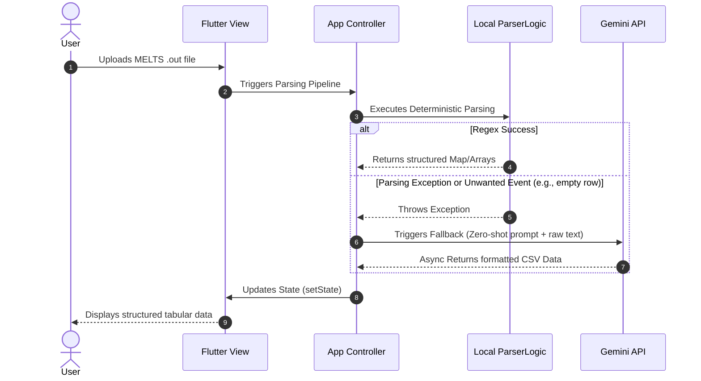
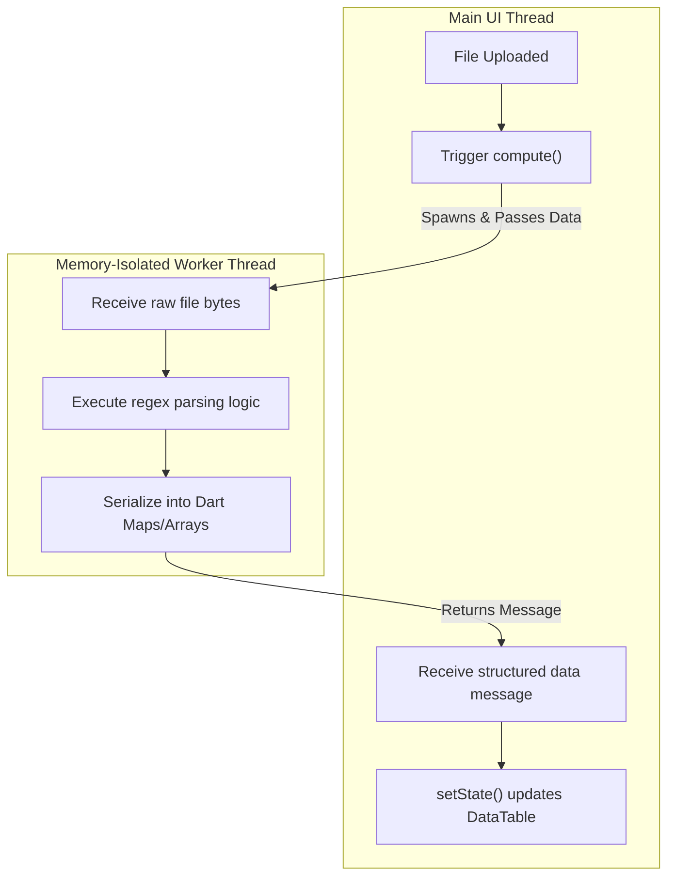
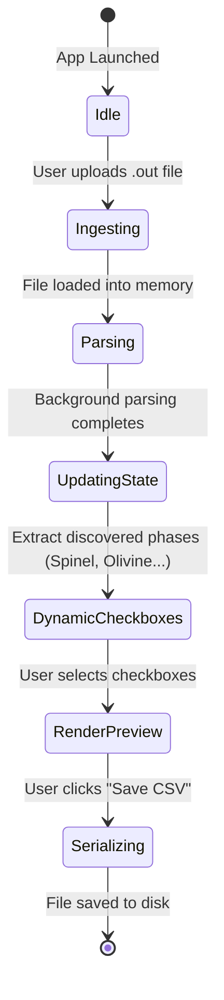

# New Figures for MELTS Parser Thesis

## 1. Performance Bar Chart (Mermaid format)

```mermaid
%%{init: {'theme': 'base', 'themeVariables': { 'primaryColor': '#a7c1e3', 'secondaryColor': '#f1a3a3', 'tertiaryColor': '#fff'}}}%%
xychart-beta
    title "Performance Benchmark: Local Parser vs. Gemini API (ms)"
    x-axis ["FC", "EC-FF", "FC-FF", "EC", "EM", "EM-FF", "FM"]
    y-axis "Execution Time (ms)" 0 --> 1200
    bar [31, 7, 13, 12, 37, 9, 10]
    bar [1153, 569, 991, 386, 1106, 981, 692]
```

## 2. Sequence Diagram for the Fallback Mechanism (Local First)

## 3. Dart Isolate / Threading Diagram

## 4. State Management Diagram

